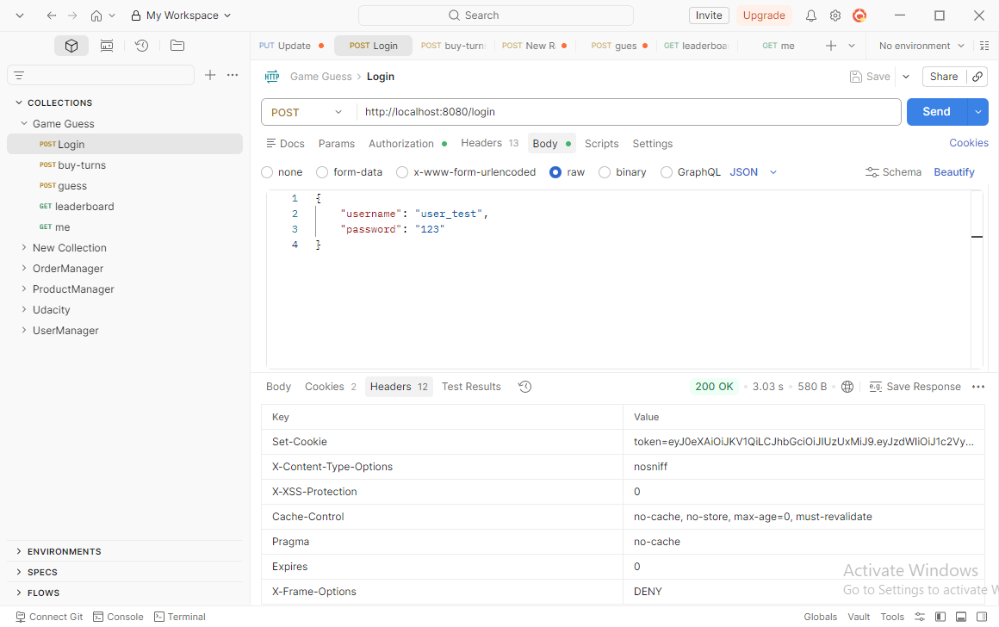
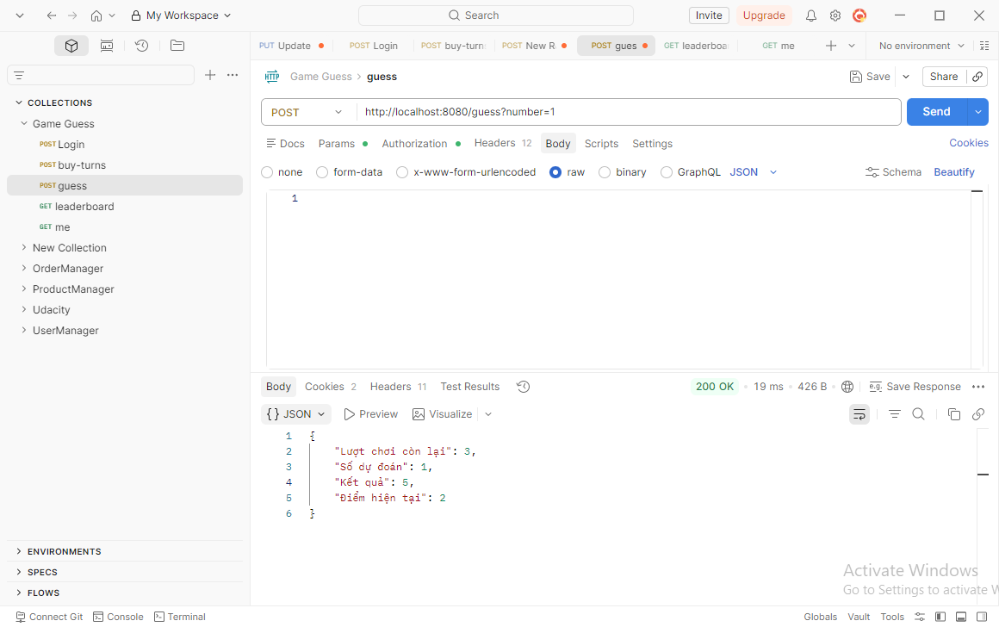
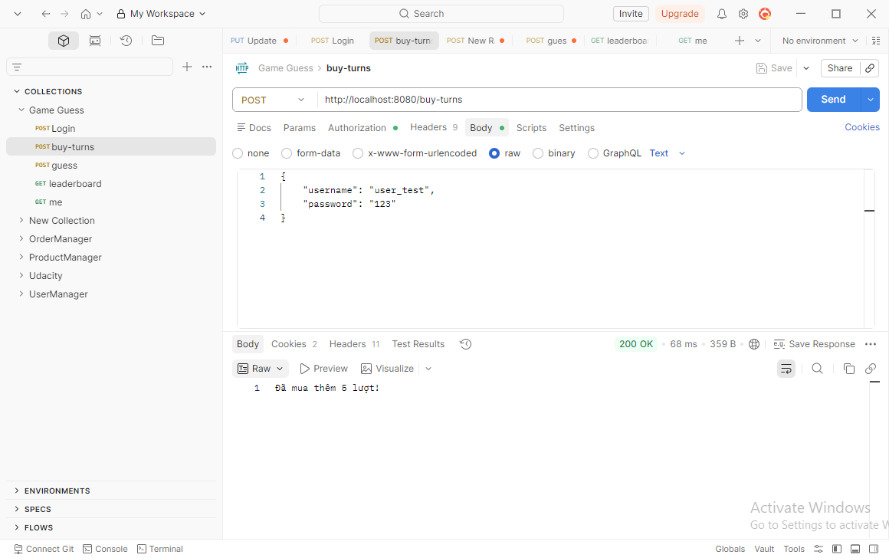
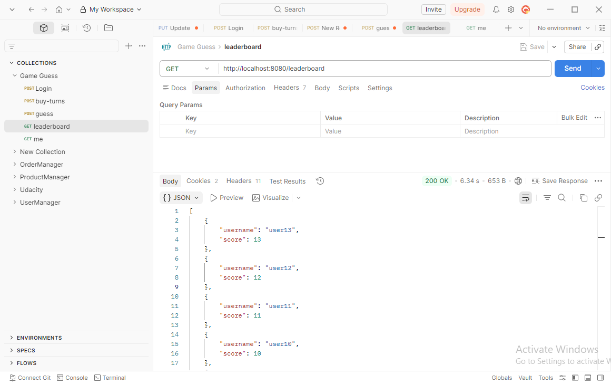
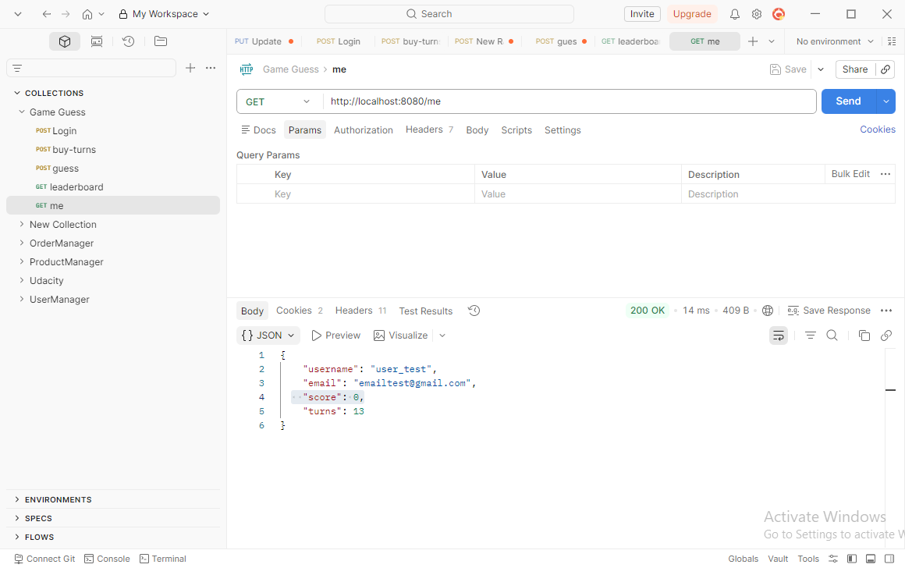
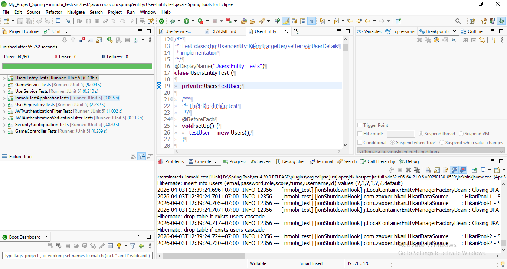

# Spring Boot Game Guess
## I. Giới thiệu
### Ứng dụng demo game đoán số với các tính năng
* Đăng nhập người dùng
* Chơi game đoán số
* Bảng xếp hạng (Leaderboard)
* Bảo mật với JWT + Spring Security
* Cache leaderboard bằng Redis

## II. Cấu trúc project
```
**inmobi_test**
├───src
**Class Main**
│   ├───main
│   │   ├───java
│   │   │   └───cooccon
│   │   │       └───spring
│   │   │           │   DataInitializer.java # Data Init
│   │   │           │   InmobiTestApplication.java
│   │   │           │
│   │   │           ├───controller
│   │   │           │       GameController.java # API /guess /buy-turns /leaderboard /me
│   │   │           │
│   │   │           ├───dto
│   │   │           │       UserMeDTO.java # DTO sử dụng cho /me
│   │   │           │       UserScoreDTO.java # DTO sử dụng cho /leaderboard
│   │   │           │
│   │   │           ├───entity
│   │   │           │       Users.java # Entity Users
│   │   │           │
│   │   │           ├───repository
│   │   │           │       UserRepository.java # Chứa truy vấn DB
│   │   │           │
│   │   │           ├───security
│   │   │           │       JWTAuthenticationFilter.java # Kiểm tra hợp lệ username, password và create token
│   │   │           │       JWTAuthenticationVerficationFilter.java # Xác thực và quyền truy cập của user
│   │   │           │       SecurityConfiguration.java # Cấu hình Spring Security, tạo các @Bean sử dụng cho project
│   │   │           │       SecurityConstants.java 
│   │   │           │
│   │   │           └───service
│   │   │                   GameService.java # Xử lý logic đoán số, synchronized guess, redis cache leaderboard...
│   │   │                   UserService.java # Xử lý logic kiểm tra username, password
│   │   │
│   │   └───resources
│   │       │   application.properties # Cấu hình DB, Port, Redis...
│   │       │   data.sql # Data Sample

```
```
**Class Test**
│   └───test
│       ├───java
│       │   └───cooccon
│       │       └───spring
│       │           │   DelegatingServletInputStream.java
│       │           │   InmobiTestApplicationTests.java
│       │           │
│       │           ├───controller
│       │           │       GameControllerTest.java
│       │           │
│       │           ├───entity
│       │           │       UsersEntityTest.java
│       │           │
│       │           ├───repository
│       │           │       UserRepositoryTest.java
│       │           │
│       │           ├───security
│       │           │       JWTAuthenticationFilterTest.java
│       │           │       JWTAuthenticationVerficationFilterTest.java
│       │           │       SecurityConfigurationTest.java
│       │           │
│       │           └───service
│       │                   GameServiceTest.java
│       │                   UserServiceTest.java
│       │
│       └───resources
│               application-test.properties
```
## III. Công nghệ sử dụng
| Công Nghệ | Phiên Bản | Mục Đích |
|-----------|---------|---------|
| **Java** | 21 | Ngôn ngữ lập trình |
| **Spring Boot** | 4.0.0 | Framework web |
| **Spring Data JPA** | Mới nhất | ORM & truy cập cơ sở dữ liệu |
| **Spring Security** | Mới nhất | Xác thực & phân quyền |
| **H2 Database** | Mới nhất | Cơ sở dữ liệu trong bộ nhớ |
| **Redis** | 7.x | Lớp caching |
| **Docker** | Mới nhất | Containerization |
| **Maven** | 3.8+ | Công cụ build |
| **JUnit 5** | Mới nhất | JUnit Test |
| **Mockito** | 5.2.0 | JUnit Test |
| **Spring Test** | Mới nhất | JUnit Test |

## IV. Bảo mật
1. Xử lý sao để đảm bảo tính đúng đắn của API khi user gọi /guess nhiều lần cùng lúc
   - Sử dụng synchronized trong GameService để xử lý các lệnh /guess đồng thời
2. Đảm bảo khi hệ thống có lượng user lớn, các api /leaderboard /me vẫn trả kết quả nhanh.
   - Tạo index cho 2 column(username, score) bảng user.
   - Dùng Redis hoặc cache trong memory để lưu kết quả leaderboard
   - Cập nhật định kỳ (ví dụ mỗi 1 phút hoặc khi có thay đổi điểm). 
3. Cơ chế bảo mật cho API.
   - Sử dụng JWT và login mặc định của Spring Security để xác thực và quyền truy cập dưới dạng token của các API.
## V. Sơ Đồ Cơ Sở Dữ Liệu
```
CREATE TABLE users (
  id BIGINT PRIMARY KEY AUTO_INCREMENT,
  username VARCHAR(255) UNIQUE NOT NULL,
  email VARCHAR(255),
  password VARCHAR(255) NOT NULL,
  role VARCHAR(255),
  score INT DEFAULT 0,
  turns INT DEFAULT 0
);

-- Indexes để tối ưu hiệu suất
CREATE INDEX idx_username ON users(username);
CREATE INDEX idx_score ON users(score DESC);
```

## VI. Hướng dẫn setup môi trường
### 1. Chạy Redis bằng Docker
``bash  
docker pull redis:7  
docker run -d --name redis-server -p 6379:6379 redis:7
### 2. Build bằng Maven
mvn clean install  
mvn spring-boot:run
### 3. Cách lấy token/đăng nhập

### 4. API Endpoints 
**URL Cơ Sở: http://localhost:8080**  
**Tất cả các endpoint (ngoại trừ /login) đều yêu cầu JWT token trong header Authorization:**  
**POST /login(Đăng Nhập & Lấy Token)**
  
**POST /guess(Đoán số)**  
  
**POST /buy-turns(Mua thêm 5 lượt chơi cho user hiện tại)**  
  
**GET /leaderboard(Danh sách 10 user điểm cao nhất)**  
  
**GET /me(Trả về email, score, turns còn lại)**  


## VII. Chi tiết các Test Classes
### 1. **GameControllerTest.java** (5 test cases)
**Mục đích:** Kiểm thử các API endpoint của GameController

| Test Case | Mô tả |
|-----------|-------|
| `testGuessEndpoint_WhenGuessCorrect()` | Kiểm tra endpoint `/guess` khi đoán đúng số |
| `testBuyTurnsEndpoint()` | Kiểm tra endpoint `/buy-turns` mua thêm lượt chơi |
| `testLeaderboardEndpoint()` | Kiểm tra endpoint `/leaderboard` lấy top 10 người chơi |
| `testMeEndpoint()` | Kiểm tra endpoint `/me` lấy thông tin user hiện tại |
| `testGuessEndpoint_UserNotFound()` | Kiểm tra xử lý lỗi khi user không tồn tại |

---

### 2. **GameServiceTest.java** (6 test cases)
**Mục đích:** Kiểm thử business logic của game

| Test Case | Mô tả |
|-----------|-------|
| `testGuessNumber_NoTurnsLeft()` | Kiểm tra khi người dùng hết lượt chơi |
| `testGuessNumber_CorrectGuess()` | Kiểm tra logic khi đoán đúng số |
| `testBuyTurns()` | Kiểm tra chức năng mua thêm 5 lượt chơi |
| `testLeaderboard_FromCache()` | Kiểm tra lấy leaderboard từ Redis cache |
| `testLeaderboard_FromDatabase()` | Kiểm tra lấy leaderboard từ DB khi cache trống |
| `testGuessNumber_ThreadSafety()` | Kiểm tra thread safety khi đoán số đồng thời |

---

### 3. **UserServiceTest.java** (5 test cases)
**Mục đích:** Kiểm thử UserDetailsService và xác thực người dùng

| Test Case | Mô tả |
|-----------|-------|
| `testLoadUserByUsername_Success()` | Kiểm tra load user thành công |
| `testLoadUserByUsername_UserNotFound()` | Kiểm tra lỗi khi user không tồn tại |
| `testLoadUserByUsername_CheckUserDetails()` | Kiểm tra thông tin chi tiết user |
| `testLoadUserByUsername_CheckAuthorities()` | Kiểm tra quyền (authorities) của user |
| `testLoadUserByUsername_NoRole()` | Kiểm tra xử lý khi user không có role |

---

### 4. **UsersEntityTest.java** (11 test cases)
**Mục đích:** Kiểm thử Users entity và UserDetails implementation

| Test Case | Mô tả |
|-----------|-------|
| `testEmptyConstructor()` | Kiểm tra constructor không tham số |
| `testParameterizedConstructor()` | Kiểm tra constructor có tham số |
| `testIdGetterSetter()`, `testUsernameGetterSetter()`, ... | Kiểm tra getter/setter cho mỗi field |
| `testGetAuthorities_ValidRole()` | Kiểm tra lấy authorities với role hợp lệ |
| `testGetAuthorities_NullRole()` | Kiểm tra authorities khi role null |
| `testDefaultScoreValue()`, `testDefaultTurnsValue()` | Kiểm tra giá trị mặc định |

---

### 5. **UserRepositoryTest.java** (9 test cases)
**Mục đích:** Kiểm thử JPA repository queries với H2 database

| Test Case | Mô tả |
|-----------|-------|
| `testFindByUsername_Success()` | Kiểm tra tìm user theo username |
| `testFindByUsername_NotFound()` | Kiểm tra khi user không tồn tại |
| `testFindByUsername_UniqueConstraint()` | Kiểm tra unique constraint của username |
| `testFindTop10UsersByScore()` | Kiểm tra lấy top 10 user theo điểm cao nhất |
| `testFindMe()` | Kiểm tra lấy thông tin chi tiết user |
| `testSave()` | Kiểm tra lưu user mới |
| `testUpdate()` | Kiểm tra cập nhật user |
| `testDelete()` | Kiểm tra xóa user |

---

### 6. **JWTAuthenticationFilterTest.java** (4 test cases)
**Mục đích:** Kiểm thử quá trình xác thực đăng nhập và cấp JWT token

| Test Case | Mô tả |
|-----------|-------|
| `testAttemptAuthentication_Success()` | Kiểm tra đăng nhập thành công |
| `testAttemptAuthentication_Failure()` | Kiểm tra đăng nhập với password sai |
| `testAttemptAuthentication_InvalidJson()` | Kiểm tra xử lý JSON không hợp lệ |
| `testConstructor_AuthenticationManagerSet()` | Kiểm tra AuthenticationManager được set |

---

### 7. **JWTAuthenticationVerficationFilterTest.java** (7 test cases)
**Mục đích:** Kiểm thử xác thực JWT token từ cookie

| Test Case | Mô tả |
|-----------|-------|
| `testDoFilterInternal_ValidToken()` | Kiểm tra xác thực với token hợp lệ |
| `testDoFilterInternal_NoCookies()` | Kiểm tra khi không có cookie |
| `testDoFilterInternal_OtherCookie()` | Kiểm tra khi cookie không phải token |
| `testDoFilterInternal_EmptyCookies()` | Kiểm tra mảng cookie rỗng |
| `testDoFilterInternal_InvalidToken()` | Kiểm tra token không hợp lệ |
| `testDoFilterInternal_TamperedToken()` | Kiểm tra token bị giả mạo |
| `testConstructor()` | Kiểm tra constructor filter |

---

### 8. **SecurityConfigurationTest.java** (8 test cases)
**Mục đích:** Kiểm thử Spring Security configuration và các bean

| Test Case | Mô tả |
|-----------|-------|
| `testSecurityFilterChainBean()` | Kiểm tra SecurityFilterChain bean tồn tại |
| `testAuthenticationManagerBean()` | Kiểm tra AuthenticationManager bean tồn tại |
| `testBCryptPasswordEncoderBean()` | Kiểm tra BCryptPasswordEncoder bean tồn tại |
| `testRedisTemplateBean()` | Kiểm tra RedisTemplate bean tồn tại |
| `testBCryptPasswordEncoding()` | Kiểm tra mã hóa password |
| `testBCryptPasswordEncoding_DifferentEachTime()` | Kiểm tra mỗi lần mã hóa khác nhau |
| `testRedisTemplateConfiguration()` | Kiểm tra RedisTemplate được cấu hình |
| `testSecurityConstants()` | Kiểm tra giá trị SecurityConstants |

---
### 9. Run JUnit Test 
**Chạy tất cả tests:**
```
mvn test
```
**Chạy một test class cụ thể:**
```
mvn test -Dtest=GameControllerTest
```
**Evidence**



